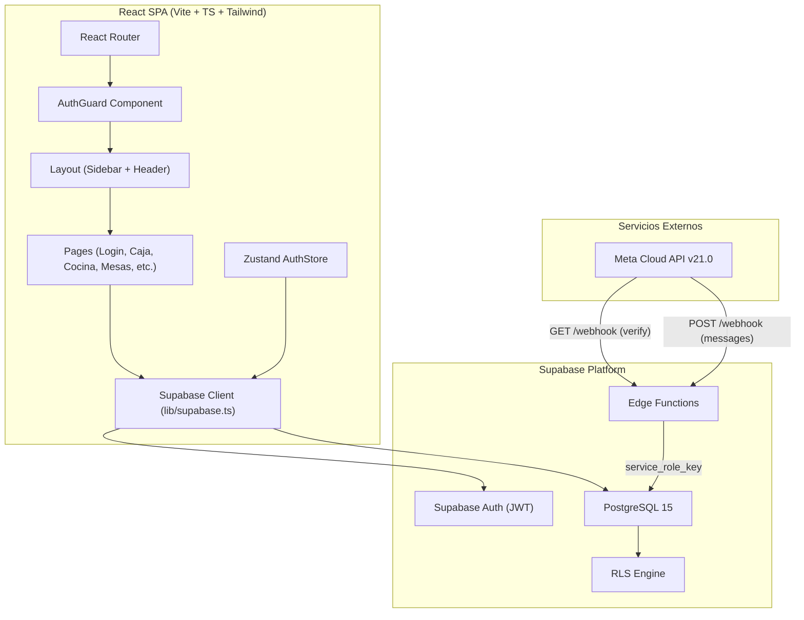
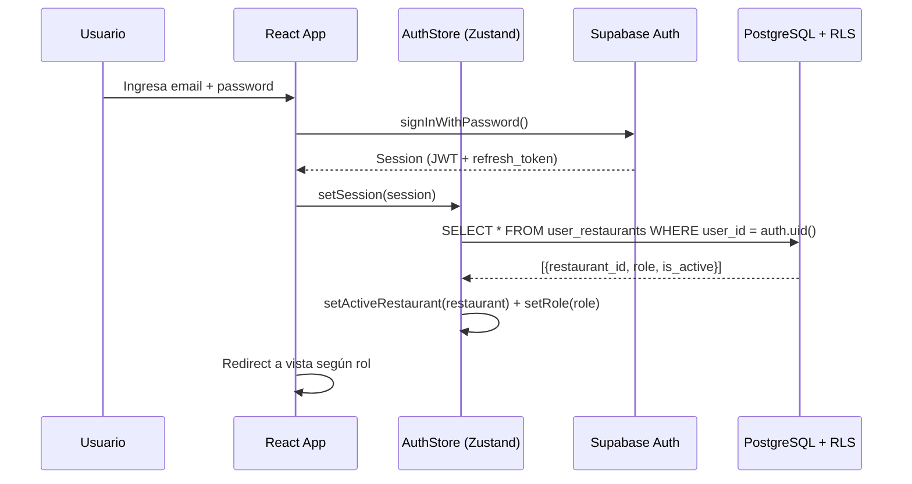
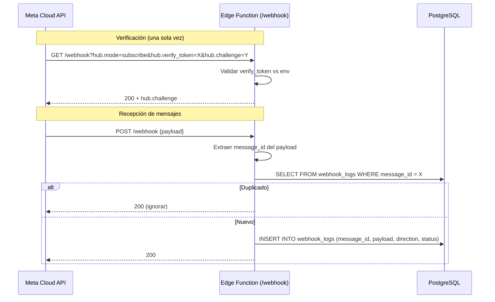
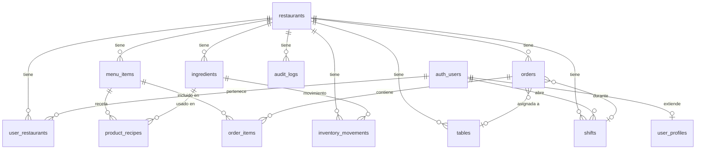

# Diseño Técnico — BOTNIK POS Foundation

## Overview

Este documento describe el diseño técnico de la Fase 1 (Fundación) del sistema BOTNIK: un POS multi-tenant para restaurantes con integración WhatsApp. La fase cubre:

1. Esquema SQL completo con 13 tablas y migraciones versionadas
2. Row Level Security (RLS) para aislamiento multi-tenant por `restaurant_id`
3. Autenticación con Supabase Auth (email/password) y creación automática de perfil
4. Sistema de roles (owner, admin, cashier, waiter, kitchen) con asignación controlada
5. Seed data idempotente para desarrollo
6. Webhook endpoint de Meta Cloud API v21.0 (verificación GET + recepción POST)
7. Estructura base del proyecto React 18 + Vite + TypeScript + Tailwind CSS con routing protegido

El stack es: React 18 / Vite / TypeScript / Tailwind CSS en frontend, Supabase (PostgreSQL 15, Auth, Realtime, RLS, Edge Functions) en backend. El aislamiento de datos se logra mediante RLS policies que filtran por `restaurant_id` consultando la tabla `user_restaurants`.

## Architecture

### Diagrama de Arquitectura General



### Decisiones de Arquitectura

| Decisión        | Elección                              | Justificación                                                                                 |
| --------------- | ------------------------------------- | --------------------------------------------------------------------------------------------- |
| Multi-tenancy   | RLS por `restaurant_id`               | Aislamiento a nivel de fila sin lógica en aplicación. PostgreSQL lo aplica automáticamente.   |
| Autenticación   | Supabase Auth                         | JWT integrado con RLS. `auth.uid()` disponible en policies sin código extra.                  |
| Estado global   | Zustand                               | Ligero, sin boilerplate. Ideal para sesión, rol activo y restaurante seleccionado.            |
| Enums           | CHECK constraints                     | Más flexibles que tipos ENUM de PostgreSQL. Se pueden modificar sin migraciones destructivas. |
| Webhook handler | Supabase Edge Function                | Ejecuta en el edge, acceso directo a DB con `service_role_key`, respuesta rápida (<5s).       |
| Migraciones     | Supabase CLI (`supabase/migrations/`) | Formato estándar, versionado, reproducible en cualquier entorno.                              |
| Routing         | React Router v6                       | Estándar de la industria para SPAs React. Soporta rutas anidadas y guards.                    |

### Flujo de Autenticación



### Flujo del Webhook Meta



## Components and Interfaces

### 1. Migraciones SQL (`supabase/migrations/`)

Archivos SQL ejecutados en orden cronológico por Supabase CLI.

| Migración                                       | Contenido                                              |
| ----------------------------------------------- | ------------------------------------------------------ |
| `00000000000001_create_restaurants.sql`         | Tabla `restaurants`                                    |
| `00000000000002_create_user_profiles.sql`       | Tabla `user_profiles` con FK a `auth.users`            |
| `00000000000003_create_user_restaurants.sql`    | Tabla `user_restaurants` con roles y UNIQUE constraint |
| `00000000000004_create_menu_items.sql`          | Tabla `menu_items`                                     |
| `00000000000005_create_ingredients.sql`         | Tabla `ingredients`                                    |
| `00000000000006_create_product_recipes.sql`     | Tabla `product_recipes` con UNIQUE constraint          |
| `00000000000007_create_tables.sql`              | Tabla `tables`                                         |
| `00000000000008_create_shifts.sql`              | Tabla `shifts`                                         |
| `00000000000009_create_orders.sql`              | Tabla `orders` con CHECK constraints                   |
| `00000000000010_create_order_items.sql`         | Tabla `order_items`                                    |
| `00000000000011_create_inventory_movements.sql` | Tabla `inventory_movements`                            |
| `00000000000012_create_webhook_logs.sql`        | Tabla `webhook_logs` con UNIQUE en `message_id`        |
| `00000000000013_create_audit_logs.sql`          | Tabla `audit_logs`                                     |
| `00000000000014_create_indexes.sql`             | Los 11 índices definidos en el esquema                 |
| `00000000000015_enable_rls.sql`                 | Habilitar RLS en todas las tablas                      |
| `00000000000016_create_rls_policies.sql`        | Todas las policies de RLS                              |

### 2. Edge Function: Webhook Handler (`supabase/functions/webhook/index.ts`)

```typescript
// Interfaz del handler
interface WebhookHandler {
  // GET — Verificación de Meta
  handleVerification(req: Request): Response;
  // POST — Recepción de mensajes
  handleMessage(req: Request): Response;
}

// Parámetros de verificación GET
interface VerificationParams {
  "hub.mode": string;
  "hub.verify_token": string;
  "hub.challenge": string;
}

// Estructura del log en webhook_logs
interface WebhookLog {
  message_id: string | null;
  direction: "inbound" | "outbound";
  payload: Record<string, unknown>;
  status: "received" | "processed" | "failed" | "ignored";
  error_message?: string;
  processing_ms?: number;
}
```

Responsabilidades:

- Verificación GET: validar `hub.verify_token` contra `WHATSAPP_VERIFY_TOKEN`, responder con `hub.challenge`
- Recepción POST: extraer `message_id`, verificar idempotencia, loguear en `webhook_logs`, responder 200 en <5s
- Usa `SUPABASE_SERVICE_ROLE_KEY` para bypass de RLS al insertar en `webhook_logs`

### 3. Cliente Supabase (`src/lib/supabase.ts`)

```typescript
import { createClient } from "@supabase/supabase-js";
import type { Database } from "./types";

export const supabase = createClient<Database>(
  import.meta.env.VITE_SUPABASE_URL,
  import.meta.env.VITE_SUPABASE_ANON_KEY,
);
```

### 4. Auth Store (`src/stores/authStore.ts`)

```typescript
interface AuthState {
  session: Session | null;
  user: User | null;
  profile: UserProfile | null;
  activeRestaurant: Restaurant | null;
  role: UserRole | null;
  userRestaurants: UserRestaurant[];
  isLoading: boolean;

  // Actions
  initialize: () => Promise<void>;
  signIn: (email: string, password: string) => Promise<void>;
  signUp: (email: string, password: string, fullName: string) => Promise<void>;
  signOut: () => Promise<void>;
  setActiveRestaurant: (restaurant: Restaurant, role: UserRole) => void;
}
```

### 5. Auth Guard (`src/components/layout/AuthGuard.tsx`)

```typescript
interface AuthGuardProps {
  children: React.ReactNode;
  requiredRoles?: UserRole[]; // Si vacío, solo requiere autenticación
}
```

Lógica:

1. Si no hay sesión → redirect a `/login`
2. Si hay sesión pero no hay restaurante activo → redirect a selector de restaurante
3. Si `requiredRoles` está definido y el rol actual no está incluido → redirect a vista permitida
4. Si todo OK → renderizar `children`

### 6. Layout (`src/components/layout/`)

| Componente      | Responsabilidad                                                                      |
| --------------- | ------------------------------------------------------------------------------------ |
| `AppLayout.tsx` | Wrapper con sidebar + header + contenido. Responsivo (sidebar colapsable en mobile). |
| `Sidebar.tsx`   | Navegación lateral. Filtra opciones según `role` del `authStore`.                    |
| `Header.tsx`    | Nombre del restaurante, usuario actual, botón de logout.                             |

### 7. Router (`src/App.tsx`)

```typescript
// Estructura de rutas
const routes = [
  { path: '/login', element: <LoginPage />, public: true },
  { path: '/', element: <AuthGuard><AppLayout /></AuthGuard>, children: [
    { path: 'caja', element: <AuthGuard requiredRoles={['owner','admin','cashier']}><CajaPage /></AuthGuard> },
    { path: 'cocina', element: <AuthGuard requiredRoles={['owner','admin','cashier','kitchen']}><CocinaPage /></AuthGuard> },
    { path: 'mesas', element: <AuthGuard requiredRoles={['owner','admin','cashier','waiter','kitchen']}><MesasPage /></AuthGuard> },
    { path: 'inventario', element: <AuthGuard requiredRoles={['owner','admin','cashier','kitchen']}><InventarioPage /></AuthGuard> },
    { path: 'turnos', element: <AuthGuard requiredRoles={['owner','admin','cashier','waiter','kitchen']}><TurnosPage /></AuthGuard> },
    { path: 'config', element: <AuthGuard requiredRoles={['owner','admin']}><ConfigPage /></AuthGuard> },
  ]},
];
```

### 8. Seed Script (`supabase/seed.sql`)

Estrategia de idempotencia: usar `INSERT ... ON CONFLICT DO NOTHING` para todas las inserciones. El restaurante demo se identifica por su `slug` único.

## Data Models

### Tipos TypeScript (generados desde el esquema)

```typescript
// Roles del sistema
type UserRole = "owner" | "admin" | "cashier" | "waiter" | "kitchen";

// Estados
type TableStatus = "free" | "occupied" | "reserved";
type ShiftStatus = "active" | "closed";
type OrderType = "dinein" | "pickup" | "delivery" | "whatsapp";
type OrderStatus =
  | "pending"
  | "confirmed"
  | "preparing"
  | "ready"
  | "delivered"
  | "paid"
  | "cancelled"
  | "refunded";
type PaymentStatus = "pending" | "paid" | "refunded";
type InventoryMovementType =
  | "purchase"
  | "consumption"
  | "adjustment"
  | "waste";
type IngredientUnit = "g" | "ml" | "unit";
type WebhookDirection = "inbound" | "outbound";
type WebhookStatus = "received" | "processed" | "failed" | "ignored";

// Entidades principales
interface Restaurant {
  id: string;
  name: string;
  slug: string;
  phone: string | null;
  address: string | null;
  timezone: string;
  currency: string;
  tax_rate: number;
  is_active: boolean;
  created_at: string;
  updated_at: string;
}

interface UserProfile {
  id: string;
  full_name: string;
  avatar_url: string | null;
  phone: string | null;
  created_at: string;
}

interface UserRestaurant {
  id: string;
  user_id: string;
  restaurant_id: string;
  role: UserRole;
  is_active: boolean;
  created_at: string;
}

interface MenuItem {
  id: string;
  restaurant_id: string;
  name: string;
  description: string | null;
  price: number;
  category: string;
  image_url: string | null;
  is_available: boolean;
  sort_order: number;
  created_at: string;
  updated_at: string;
}

interface Ingredient {
  id: string;
  restaurant_id: string;
  name: string;
  unit: IngredientUnit;
  current_stock: number;
  min_stock: number;
  cost_per_unit: number;
  created_at: string;
  updated_at: string;
}

interface ProductRecipe {
  id: string;
  menu_item_id: string;
  ingredient_id: string;
  quantity_needed: number;
  created_at: string;
}

interface Table {
  id: string;
  restaurant_id: string;
  label: string;
  capacity: number;
  status: TableStatus;
  zone: string | null;
  sort_order: number;
  created_at: string;
}

interface Shift {
  id: string;
  restaurant_id: string;
  user_id: string;
  status: ShiftStatus;
  opening_cash: number;
  closing_cash: number | null;
  expected_cash: number | null;
  total_sales: number | null;
  total_orders: number | null;
  difference: number | null;
  notes: string | null;
  opened_at: string;
  closed_at: string | null;
}

interface Order {
  id: string;
  restaurant_id: string;
  order_number: string;
  order_type: OrderType;
  status: OrderStatus;
  table_id: string | null;
  shift_id: string | null;
  customer_name: string | null;
  customer_phone: string | null;
  delivery_address: string | null;
  subtotal: number;
  tax: number;
  total: number;
  payment_status: PaymentStatus;
  notes: string | null;
  cancel_reason: string | null;
  wa_message_id: string | null;
  created_by: string | null;
  created_at: string;
  updated_at: string;
}

interface OrderItem {
  id: string;
  order_id: string;
  menu_item_id: string;
  quantity: number;
  unit_price: number;
  subtotal: number;
  modifiers: string[];
  notes: string | null;
  created_at: string;
}

interface InventoryMovement {
  id: string;
  restaurant_id: string;
  ingredient_id: string;
  type: InventoryMovementType;
  quantity: number;
  reference_id: string | null;
  notes: string | null;
  created_by: string | null;
  created_at: string;
}

interface WebhookLog {
  id: string;
  restaurant_id: string | null;
  message_id: string | null;
  direction: WebhookDirection;
  payload: Record<string, unknown>;
  status: WebhookStatus;
  error_message: string | null;
  processing_ms: number | null;
  created_at: string;
}

interface AuditLog {
  id: string;
  restaurant_id: string;
  user_id: string | null;
  action: string;
  entity_type: string;
  entity_id: string;
  old_data: Record<string, unknown> | null;
  new_data: Record<string, unknown> | null;
  ip_address: string | null;
  created_at: string;
}
```

### Diagrama Entidad-Relación



### Matriz de Permisos RLS

| Tabla                 | Lectura                                      | Escritura                                | Notas                              |
| --------------------- | -------------------------------------------- | ---------------------------------------- | ---------------------------------- |
| `restaurants`         | Usuarios activos del tenant                  | owner, admin                             | —                                  |
| `user_profiles`       | Propio usuario o owner del mismo restaurante | Propio usuario                           | —                                  |
| `user_restaurants`    | Usuarios del tenant                          | owner                                    | Solo owner asigna roles            |
| `menu_items`          | Usuarios del tenant                          | owner, admin                             | —                                  |
| `ingredients`         | Usuarios del tenant                          | owner, admin, cashier                    | —                                  |
| `product_recipes`     | Usuarios del tenant                          | owner, admin                             | —                                  |
| `tables`              | Usuarios del tenant                          | owner, admin, cashier, waiter            | —                                  |
| `shifts`              | Usuarios del tenant                          | owner, admin, cashier, waiter, kitchen   | Todos abren turnos                 |
| `orders`              | Usuarios del tenant                          | owner, admin, cashier                    | —                                  |
| `order_items`         | Usuarios del tenant                          | owner, admin, cashier                    | Via orden                          |
| `inventory_movements` | Usuarios del tenant                          | owner, admin, cashier                    | —                                  |
| `webhook_logs`        | Usuarios del tenant                          | service_role (sin auth)                  | Edge Function usa service_role_key |
| `audit_logs`          | Usuarios del tenant                          | Cualquier usuario autenticado del tenant | —                                  |

## Correctness Properties

_Una propiedad es una característica o comportamiento que debe mantenerse verdadero en todas las ejecuciones válidas de un sistema — esencialmente, una declaración formal sobre lo que el sistema debe hacer. Las propiedades sirven como puente entre especificaciones legibles por humanos y garantías de corrección verificables por máquinas._

### Property 1: Convenciones de esquema en todas las tablas

_Para cualquier_ tabla del sistema, la primary key debe ser de tipo UUID con default `gen_random_uuid()`, debe existir la columna `created_at TIMESTAMPTZ DEFAULT now()`, y para las tablas de negocio (todas excepto `user_profiles`) debe existir `restaurant_id UUID NOT NULL` con FK a `restaurants(id) ON DELETE CASCADE`.

**Validates: Requirements 1.3, 1.4, 1.6**

### Property 2: CHECK constraints rechazan valores inválidos

_Para cualquier_ columna con CHECK constraint (roles, estados, tipos) y _para cualquier_ string que no esté en la lista de valores permitidos, un INSERT con ese valor debe ser rechazado por la base de datos. Esto incluye que `user_restaurants.role` solo acepte exactamente los 5 roles: owner, admin, cashier, waiter, kitchen.

**Validates: Requirements 1.7, 4.1**

### Property 3: Aislamiento multi-tenant por RLS

_Para cualquier_ usuario autenticado y _para cualquier_ tabla de negocio, las filas retornadas por un SELECT deben tener `restaurant_id` que coincida exclusivamente con los restaurantes donde el usuario tiene un registro activo (`is_active = true`) en `user_restaurants`. Si el usuario no tiene ningún registro activo, debe recibir cero filas.

**Validates: Requirements 2.1, 2.2, 2.10, 4.5**

### Property 4: Escritura RLS según matriz de roles

_Para cualquier_ usuario autenticado con un rol dado y _para cualquier_ tabla de negocio, un INSERT/UPDATE debe ser permitido si y solo si el rol del usuario está en la lista de roles autorizados para escritura en esa tabla. Específicamente: `menu_items` → owner/admin; `ingredients` → owner/admin/cashier; `orders` → owner/admin/cashier; `tables` → owner/admin/cashier/waiter; `user_restaurants` → solo owner.

**Validates: Requirements 2.3, 2.4, 2.5, 2.6, 4.6**

### Property 5: Lectura de user_profiles restringida

_Para cualquier_ usuario autenticado, un SELECT en `user_profiles` debe retornar solo su propio perfil, a menos que el usuario tenga rol `owner` en un restaurante compartido con el usuario consultado, en cuyo caso también puede ver ese perfil.

**Validates: Requirements 2.7**

### Property 6: Creación automática de perfil al registrarse

_Para cualquier_ registro exitoso de usuario vía Supabase Auth, debe existir un registro correspondiente en `user_profiles` con el mismo `id` y el `full_name` proporcionado durante el registro.

**Validates: Requirements 3.4**

### Property 7: Mensajes de error no revelan existencia de email

_Para cualquier_ intento de login con credenciales inválidas (email inexistente o password incorrecto), el mensaje de error retornado debe ser idéntico independientemente de si el email existe o no en el sistema.

**Validates: Requirements 3.7**

### Property 8: Idempotencia del seed script

_Para cualquier_ número de ejecuciones consecutivas del seed script (N ≥ 1), el conteo de registros en cada tabla debe ser idéntico al conteo después de la primera ejecución. No se generan duplicados.

**Validates: Requirements 5.7**

### Property 9: Verificación de webhook — validación de token

_Para cualquier_ par de strings (token_enviado, token_configurado), el webhook handler GET debe responder con HTTP 200 y el `hub.challenge` si y solo si `token_enviado === token_configurado`. En cualquier otro caso, debe responder con HTTP 403.

**Validates: Requirements 6.1, 6.2, 6.3**

### Property 10: Verificación de webhook — parámetros requeridos

_Para cualquier_ subconjunto estricto de los 3 parámetros requeridos (`hub.mode`, `hub.verify_token`, `hub.challenge`), el webhook handler GET debe responder con HTTP 400.

**Validates: Requirements 6.4**

### Property 11: Registro completo de webhook POST

_Para cualquier_ payload válido de mensaje WhatsApp enviado al webhook POST, el sistema debe crear un registro en `webhook_logs` que contenga: el `message_id` extraído del payload, `direction = 'inbound'`, `status = 'received'`, el payload crudo completo, y `processing_ms` como entero no negativo.

**Validates: Requirements 7.1, 7.2, 7.7**

### Property 12: Idempotencia de webhook por message_id

_Para cualquier_ `message_id` que ya existe en `webhook_logs`, un nuevo POST con el mismo `message_id` debe responder HTTP 200 sin crear un registro adicional en `webhook_logs`. El conteo de registros con ese `message_id` debe permanecer en 1.

**Validates: Requirements 7.3**

### Property 13: Webhook POST maneja payloads inválidos

_Para cualquier_ payload POST que no contenga la estructura válida de un mensaje WhatsApp (sin entry, sin changes, sin messages), el handler debe registrar el evento en `webhook_logs` con `status = 'ignored'` y responder HTTP 200.

**Validates: Requirements 7.5**

### Property 14: Control de acceso del AuthGuard

_Para cualquier_ combinación de (estado_autenticación, rol_usuario, ruta_destino), el AuthGuard debe: (a) redirigir a `/login` si no hay sesión activa, (b) bloquear acceso si el usuario no tiene restaurante activo, (c) permitir acceso si el rol está en la lista de roles permitidos para esa ruta, (d) redirigir a una vista permitida para su rol si no tiene acceso a la ruta solicitada.

**Validates: Requirements 8.3, 8.4, 8.5, 8.6**

### Property 15: Sidebar filtra opciones por rol

_Para cualquier_ rol del sistema, la sidebar debe renderizar exactamente las opciones de navegación permitidas según la matriz de permisos. Un rol que no tiene acceso a una vista no debe ver el enlace correspondiente en la sidebar.

**Validates: Requirements 8.7**

### Property 16: AuthStore mantiene estado consistente

_Para cualquier_ secuencia de operaciones (signIn → setActiveRestaurant → signOut), el AuthStore debe: tras signIn tener session y user no nulos; tras setActiveRestaurant tener activeRestaurant y role no nulos; tras signOut tener todos los campos en null/vacío.

**Validates: Requirements 8.10**

## Error Handling

### Base de Datos

| Escenario                             | Manejo                                                                                                                                |
| ------------------------------------- | ------------------------------------------------------------------------------------------------------------------------------------- |
| Violación de UNIQUE constraint        | PostgreSQL retorna error `23505`. El frontend muestra mensaje descriptivo (ej: "Este usuario ya tiene un rol en este restaurante").   |
| Violación de CHECK constraint         | PostgreSQL retorna error `23514`. El frontend valida con Zod antes de enviar para prevenir.                                           |
| Violación de FK (referencia inválida) | PostgreSQL retorna error `23503`. El frontend valida existencia antes de insertar.                                                    |
| RLS deniega acceso                    | Supabase retorna array vacío (SELECT) o error de permisos (INSERT/UPDATE). El frontend muestra "No tienes permisos para esta acción". |
| Conexión perdida con Supabase         | Retry con backoff exponencial (3 intentos). Si falla, mostrar banner "Sin conexión" con opción de reintentar.                         |

### Autenticación

| Escenario                        | Manejo                                                                                 |
| -------------------------------- | -------------------------------------------------------------------------------------- |
| Credenciales inválidas           | Mostrar "Email o contraseña incorrectos" (mensaje genérico por seguridad).             |
| Sesión expirada                  | `onAuthStateChange` detecta el cambio. Si el refresh token falla, redirect a `/login`. |
| Registro con email duplicado     | Supabase Auth retorna error genérico. Mostrar "No se pudo crear la cuenta".            |
| Usuario sin restaurante asignado | Mostrar pantalla de "Esperando asignación" con mensaje informativo.                    |

### Webhook

| Escenario                                | Manejo                                                                                                           |
| ---------------------------------------- | ---------------------------------------------------------------------------------------------------------------- |
| Token de verificación inválido           | Responder HTTP 403. No loguear (evitar spam en logs).                                                            |
| Parámetros faltantes en GET              | Responder HTTP 400 con body descriptivo.                                                                         |
| Payload POST inválido                    | Loguear en `webhook_logs` con `status: 'ignored'`. Responder HTTP 200.                                           |
| Error de DB al insertar log              | Capturar excepción, loguear en console, responder HTTP 200 (Meta no debe reintentar).                            |
| Mensaje duplicado (message_id existente) | Responder HTTP 200 silenciosamente. No insertar ni procesar.                                                     |
| Timeout de procesamiento                 | El handler debe responder 200 antes de cualquier procesamiento pesado. El procesamiento posterior se hace async. |

### Frontend

| Escenario                      | Manejo                                                                      |
| ------------------------------ | --------------------------------------------------------------------------- |
| Error de red en fetch          | Toast de error con "Error de conexión. Reintentando..." + retry automático. |
| Componente falla en render     | React Error Boundary captura y muestra fallback UI.                         |
| Variables de entorno faltantes | Validación al iniciar la app. Si faltan, mostrar error claro en consola.    |

## Testing Strategy

### Enfoque Dual: Unit Tests + Property-Based Tests

El testing de esta fase combina dos enfoques complementarios:

- **Unit tests**: Verifican ejemplos específicos, edge cases y condiciones de error. Útiles para integraciones con Supabase Auth, verificación de seed data, y configuración del proyecto.
- **Property-based tests**: Verifican propiedades universales que deben cumplirse para todos los inputs válidos. Esenciales para RLS, validación de esquema, webhook handling y control de acceso.

### Librería de Property-Based Testing

- **Lenguaje**: TypeScript
- **Librería PBT**: `fast-check` (la más madura para TypeScript/JavaScript)
- **Framework de test**: Vitest
- **Configuración**: Mínimo 100 iteraciones por property test (`fc.configureGlobal({ numRuns: 100 })`)

### Tagging de Tests

Cada property test debe incluir un comentario referenciando la propiedad del diseño:

```typescript
// Feature: botnik-pos-foundation, Property 3: Aislamiento multi-tenant por RLS
test.prop([fc.uuid(), fc.uuid()], (userId, restaurantId) => {
  // ...
});
```

### Distribución de Tests

#### Property-Based Tests (una por propiedad del diseño)

| Propiedad                      | Qué testea                   | Generadores                                                 |
| ------------------------------ | ---------------------------- | ----------------------------------------------------------- |
| P1: Convenciones de esquema    | Estructura de tablas         | Lista de nombres de tabla                                   |
| P2: CHECK constraints          | Valores inválidos rechazados | Strings aleatorios fuera de los valores permitidos          |
| P3: Aislamiento multi-tenant   | RLS filtra por restaurant_id | UUIDs de usuario/restaurante, registros en user_restaurants |
| P4: Escritura RLS por rol      | Permisos de escritura        | Combinaciones de (tabla, rol, operación)                    |
| P5: Lectura user_profiles      | Acceso restringido           | Pares de usuarios con/sin relación de restaurante           |
| P6: Perfil automático          | Registro → perfil            | Datos de registro aleatorios (email, nombre)                |
| P7: Error genérico login       | Mensaje idéntico             | Emails existentes/inexistentes con passwords incorrectos    |
| P8: Idempotencia seed          | Ejecuciones repetidas        | Número de ejecuciones (1-5)                                 |
| P9: Webhook verify token       | Validación de token          | Pares de strings (token enviado, token configurado)         |
| P10: Webhook params requeridos | Subconjuntos de params       | Subconjuntos de {hub.mode, hub.verify_token, hub.challenge} |
| P11: Registro webhook POST     | Campos del log               | Payloads válidos de WhatsApp generados                      |
| P12: Idempotencia webhook      | Duplicados ignorados         | message_ids repetidos                                       |
| P13: Payload inválido          | Status 'ignored'             | Payloads JSON sin estructura WhatsApp                       |
| P14: AuthGuard                 | Control de acceso            | Combinaciones de (autenticado, rol, ruta)                   |
| P15: Sidebar por rol           | Opciones visibles            | Roles del sistema                                           |
| P16: AuthStore                 | Estado consistente           | Secuencias de operaciones (signIn, setRestaurant, signOut)  |

#### Unit Tests (ejemplos y edge cases)

| Área               | Tests                                                                                                                                                                                                                 |
| ------------------ | --------------------------------------------------------------------------------------------------------------------------------------------------------------------------------------------------------------------- |
| Migraciones        | Las 13 tablas existen tras ejecutar migraciones (1.2). Los 11 índices existen (1.11).                                                                                                                                 |
| UNIQUE constraints | Duplicado en webhook_logs.message_id falla (1.8). Duplicado en user_restaurants(user_id, restaurant_id) falla (1.9). Duplicado en product_recipes(menu_item_id, ingredient_id) falla (1.10).                          |
| updated_at         | Existe en restaurants, menu_items, ingredients, orders (1.5).                                                                                                                                                         |
| Auth               | Registro exitoso retorna sesión (3.1). Login retorna JWT + refresh_token (3.2, 3.5). Logout invalida sesión (3.3). Refresh token renueva JWT expirado (3.6).                                                          |
| Roles              | Owner puede asignar roles (4.3). Duplicado de rol por restaurante falla (4.4).                                                                                                                                        |
| Seed data          | Restaurante demo existe con datos correctos (5.1). Al menos 1 usuario por rol (5.2). Al menos 10 menu items en 3+ categorías (5.3). Al menos 10 ingredientes (5.4). Al menos 5 recetas (5.5). Al menos 5 mesas (5.6). |
| Webhook GET        | Token válido → 200 + challenge (6.2). Token inválido → 403 (6.3).                                                                                                                                                     |
| Webhook POST       | Error de procesamiento → status 'failed' + error_message (7.6).                                                                                                                                                       |
| Frontend           | Rutas principales definidas (8.2). Cliente Supabase inicializado (8.9).                                                                                                                                               |
| RLS                | webhook_logs acepta INSERT con service_role (2.8). audit_logs acepta INSERT de cualquier usuario del tenant (2.9).                                                                                                    |

### Estructura de Archivos de Test

```
tests/
├── unit/
│   ├── migrations.test.ts        # 1.2, 1.5, 1.8, 1.9, 1.10, 1.11
│   ├── auth.test.ts              # 3.1, 3.2, 3.3, 3.5, 3.6
│   ├── roles.test.ts             # 4.3, 4.4
│   ├── seed.test.ts              # 5.1-5.6
│   ├── webhook.test.ts           # 6.2, 6.3, 7.6
│   └── frontend.test.ts          # 8.2, 8.9
├── properties/
│   ├── schema.property.test.ts   # P1, P2
│   ├── rls.property.test.ts      # P3, P4, P5
│   ├── auth.property.test.ts     # P6, P7
│   ├── seed.property.test.ts     # P8
│   ├── webhook.property.test.ts  # P9, P10, P11, P12, P13
│   └── frontend.property.test.ts # P14, P15, P16
```
