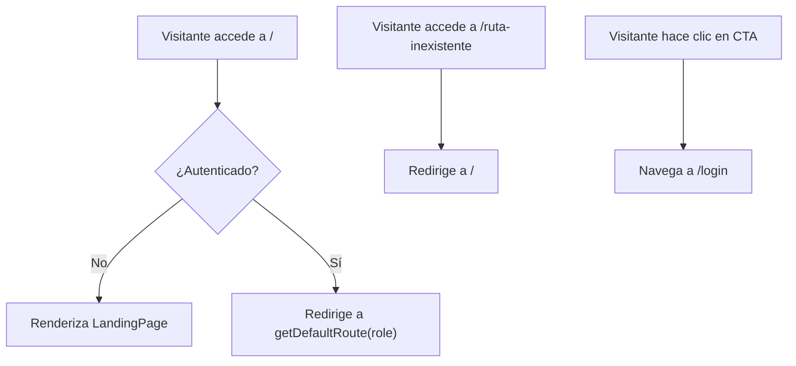

# Diseño Técnico — Landing Page Pública BOTNIK

## Overview

La Landing Page es un componente React 100% estático (`LandingPage.tsx`) que sirve como punto de entrada público para visitantes no autenticados. Se renderiza en la ruta `"/"` fuera del `AuthGuard`, presentando el producto BOTNIK con secciones de hero, funcionalidades, flujo de uso, CTA final y footer.

El cambio principal en la arquitectura de rutas es reestructurar `App.tsx` para que `"/"` sea una ruta pública que renderiza `LandingPage`, mientras las rutas protegidas se mueven bajo un path padre (ej. layout con `AuthGuard`). Los usuarios autenticados que visiten `"/"` serán redirigidos a su vista por defecto mediante un guard ligero dentro del propio `LandingPage`.

No se requiere estado global, llamadas a Supabase, ni nuevas dependencias.

## Architecture

### Diagrama de Rutas



### Cambios en App.tsx

La ruta `"/"` actualmente está envuelta en `AuthGuard` y redirige a `/caja`. Se debe reestructurar:

**Antes:**

```
/ → AuthGuard → AppLayout → Navigate to /caja
```

**Después:**

```
/ → LandingPage (público, con redirect interno si autenticado)
/app → AuthGuard → AppLayout → rutas protegidas
```

Alternativa más simple (preferida): mantener la estructura actual pero agregar la ruta `"/"` como ruta pública independiente antes de las rutas protegidas, y mover las rutas protegidas bajo un path base diferente o usar un layout route sin index.

**Enfoque elegido:** Agregar `LandingPage` como ruta pública en `"/"` con un componente wrapper `PublicRoute` que redirige a usuarios autenticados. Las rutas protegidas se reestructuran bajo un layout route sin path index que apunte a landing.

```tsx
<Routes>
  {/* Rutas públicas */}
  <Route path="/" element={<PublicRoute><LandingPage /></PublicRoute>} />
  <Route path="/login" element={<LoginPage />} />

  {/* Rutas protegidas */}
  <Route element={<AuthGuard><AppLayout /></AuthGuard>}>
    <Route path="/caja" element={...} />
    <Route path="/cocina" element={...} />
    {/* ... demás rutas */}
  </Route>

  {/* Catch-all */}
  <Route path="*" element={<Navigate to="/" replace />} />
</Routes>
```

### Componente PublicRoute

Componente ligero que verifica el estado de autenticación y redirige usuarios autenticados:

```tsx
function PublicRoute({ children }: { children: React.ReactNode }) {
  const { session, role, isLoading } = useAuthStore();
  if (isLoading) return null;
  if (session && role) return <Navigate to={getDefaultRoute(role)} replace />;
  return <>{children}</>;
}
```

Este componente se puede definir directamente en `App.tsx` ya que es pequeño y específico del routing.

## Components and Interfaces

### LandingPage (`src/pages/LandingPage.tsx`)

Componente único que contiene todas las secciones de la landing page. No recibe props. Estructura interna:

```
LandingPage
├── <header> — Hero Section
│   ├── Logo BOTNIK (SVG inline o texto estilizado)
│   ├── Tagline <p>
│   └── CTA Button <Link to="/login">
├── <main>
│   ├── <section> — Funcionalidades
│   │   └── Grid de Feature Cards (4+)
│   ├── <section> — Cómo Funciona
│   │   └── Lista de pasos (3-4)
│   └── <section> — CTA Final
│       └── CTA Button <Link to="/login">
└── <footer> — Footer
    └── "BOTNIK © {año}"
```

### Datos estáticos

Las Feature Cards y los pasos del flujo se definen como arrays constantes dentro del componente (o en la parte superior del archivo):

```typescript
interface FeatureCard {
  icon: string; // Emoji o SVG
  title: string;
  description: string;
  color: string; // Clase Tailwind del color accent (bg-rose, bg-mint, etc.)
}

interface Step {
  number: number;
  title: string;
  description: string;
}

const FEATURES: FeatureCard[] = [
  {
    icon: "💰",
    title: "Punto de Venta",
    description: "...",
    color: "tangerine",
  },
  { icon: "💬", title: "Chatbot WhatsApp", description: "...", color: "mint" },
  { icon: "📦", title: "Inventario", description: "...", color: "rose" },
  { icon: "🪑", title: "Mesas y Comandas", description: "...", color: "slate" },
];

const STEPS: Step[] = [
  { number: 1, title: "Regístrate", description: "..." },
  { number: 2, title: "Configura tu menú", description: "..." },
  { number: 3, title: "Opera tu restaurante", description: "..." },
  { number: 4, title: "Analiza resultados", description: "..." },
];
```

### PublicRoute (en `App.tsx`)

```typescript
interface PublicRouteProps {
  children: React.ReactNode;
}
```

Usa `useAuthStore` para leer `session`, `role`, `isLoading`. Redirige con `Navigate` si autenticado.

## Data Models

No se introducen nuevos modelos de datos. La landing page es 100% estática.

Los únicos datos consumidos son:

- `useAuthStore` (solo en `PublicRoute`): `session`, `role`, `isLoading` — para decidir si redirigir
- `getDefaultRoute(role)` de `src/lib/constants.ts` — para obtener la ruta destino del redirect

Las Feature Cards y Steps son constantes hardcodeadas, no modelos persistidos.

## Correctness Properties

_Una propiedad es una característica o comportamiento que debe mantenerse verdadero en todas las ejecuciones válidas de un sistema — esencialmente, una declaración formal sobre lo que el sistema debe hacer. Las propiedades sirven como puente entre especificaciones legibles por humanos y garantías de corrección verificables por máquina._

### Evaluación de aplicabilidad de PBT

Esta feature es predominantemente UI estática con contenido hardcodeado. La mayoría de los criterios de aceptación son verificaciones de renderizado (presencia de elementos, clases CSS, estructura semántica) que se prueban mejor con tests de ejemplo.

Sin embargo, existe una propiedad testeable: el comportamiento de redirección para usuarios autenticados varía según el rol, y debe ser consistente con `getDefaultRoute()` para todos los roles válidos.

### Property 1: Redirección de usuario autenticado por rol

_Para cualquier_ rol válido del sistema (owner, admin, cashier, waiter, kitchen), cuando un usuario autenticado con ese rol accede a la ruta "/", el sistema debe redirigir a la ruta devuelta por `getDefaultRoute(role)`.

**Validates: Requirements 1.2**

## Error Handling

La landing page es estática y no realiza operaciones que puedan fallar. Los escenarios de error son mínimos:

| Escenario                         | Manejo                                                             |
| --------------------------------- | ------------------------------------------------------------------ |
| `useAuthStore` en estado de carga | `PublicRoute` retorna `null` (evita flash de contenido)            |
| Fuentes web no cargan             | Tailwind aplica fallback serif/sans-serif definido en `fontFamily` |
| Ruta inexistente                  | Catch-all `"*"` redirige a `"/"`                                   |
| JavaScript deshabilitado          | La página no se renderiza (SPA — comportamiento esperado de React) |

No se requiere manejo de errores de red, ya que no hay llamadas a backend.

## Testing Strategy

### Enfoque general

Dado que la landing page es 100% estática y de UI, la estrategia se centra en **tests de ejemplo** (unit tests) que verifican renderizado correcto, estructura semántica y comportamiento de routing.

### Por qué PBT tiene alcance limitado aquí

La landing page es UI rendering con contenido estático. No hay transformaciones de datos, parsing, serialización ni lógica de negocio compleja. La única propiedad identificada (redirect por rol) es la excepción porque varía con el input (rol del usuario).

### Tests de ejemplo (unit tests con Vitest + React Testing Library)

Se necesitará agregar `@testing-library/react` y `jsdom` como dependencias de desarrollo.

1. **Routing público**: Verificar que `"/"` renderiza `LandingPage` sin sesión activa
2. **Redirect autenticado**: Verificar que usuarios con sesión son redirigidos (cubierto también por Property 1)
3. **Catch-all**: Verificar que rutas inexistentes redirigen a `"/"`
4. **Estructura semántica**: Verificar presencia de `<header>`, `<main>`, `<section>`, `<footer>`, `<h1>`, `<h2>`
5. **Hero section**: Verificar logo, tagline y CTA con enlace a `/login`
6. **Feature Cards**: Verificar al menos 4 cards con icono, título y descripción
7. **Pasos "Cómo Funciona"**: Verificar 3-4 pasos con número, título y descripción
8. **CTA final**: Verificar botón con enlace a `/login` y clases de estilo primario
9. **Footer**: Verificar texto "BOTNIK" y año actual
10. **Accesibilidad SVG**: Verificar `role="img"` y `aria-label` en el logo SVG
11. **Clases responsivas**: Verificar clases de grid responsivo en el contenedor de Feature Cards

### Property-based test (Vitest + fast-check)

- **Property 1**: Para cualquier rol válido, `PublicRoute` redirige a `getDefaultRoute(role)`
  - Librería: `fast-check` (ya instalado en el proyecto)
  - Iteraciones: mínimo 100
  - Tag: `Feature: landing-page, Property 1: Para cualquier rol válido, PublicRoute redirige a getDefaultRoute(role)`

### Configuración de tests

- Framework: Vitest (ya configurado)
- PBT: fast-check v4 (ya instalado)
- Archivos de test: `tests/landing-page.test.ts` (property test de routing) y `tests/landing-page-ui.test.tsx` (tests de renderizado, requiere jsdom + testing-library)
- Los tests de UI requieren agregar: `@testing-library/react`, `@testing-library/jest-dom`, `jsdom`
